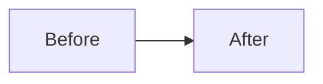

## Summary

<!-- What's changing, in 1-3 sentences. Present tense, verb-first. -->

<!--
Pick the ONE badge that matches this change, delete the other five. A badge,
not a native GitHub alert — alert headers are fixed to exactly
"Note"/"Tip"/"Important"/"Warning"/"Caution" and can't be relabeled, which
reads redundant here ("Tip: New feature"). The badge's own label IS the
signal — a reviewer should be able to gauge what kind of change this is from
color alone, before reading a word of prose.
-->

## Why

<!--
What: what's actually changing (fixed, added, removed, updated).
Where: which part of the system this touches.
Why: the problem this solves or requirement it satisfies, and why now.
Not a restated summary — say what a reader can't get from the diff alone.
-->

## Risks & Review Notes

<!--
Always [!CAUTION] — risk deserves the reviewer's attention regardless of how
low-stakes the change actually is; don't downgrade the alert to match your
own risk assessment. Say what could break, what a reviewer should
specifically check, and the rollback path in the prose — don't just leave
the alert to speak for itself. Write "None." if genuinely low-risk; the
alert still stays red.
-->

> [!CAUTION]
> None.

## Testing

<!--
Describe the actual coverage, not just that it exists:
- Unit / integration / e2e — which of these, and why that mix is right for this change
- What's mocked vs what's real (a live DB? a real external API? an in-memory fake?)
- How it runs locally (exact command) and how it runs in CI (which job/workflow)
- What targets it exercises — APIs, databases, specific requirements/acceptance criteria
- Manual test steps, if any part of this can't be covered by automation
-->

- Unit tests added/updated
- Integration/e2e tests added/updated
- Manual testing completed

## Change Diagram

<!--
Optional. A mermaid diagram of what's changing — architecture, data/call
flow, before-vs-after. Wrapped in 
 so it doesn't dominate the PR
body; a reviewer opts in rather than scrolling past it. Most useful (and
encouraged, not required) when an AI agent authored this change, so a human
can verify the actual code flow without re-deriving it from the diff. Delete
this whole section if a diagram wouldn't add anything past the diff itself.
-->

Diagram

## Checklist

<!--
This is a gate, not a formality — don't check anything from habit.
1. Adversarial self-review: re-read your own diff as a reviewer actively
   trying to find a reason to reject it. Look for the thing you'd be
   embarrassed to have someone else find first. If you find something, fix
   it before continuing — don't check the box and hope.
2. Actually run the checks below; don't assume an earlier run still holds
   after later edits. For "Tests pass," paste the real command and its real
   result (pass/fail counts, exit status) — a bare assertion isn't evidence.
3. If this repo has a pre-push hook or CI gate that independently re-runs
   tests/lint, treat that as a backstop, not a substitute for doing this
   properly before you ever push.
-->

- Conventions followed
- Self-reviewed (adversarially — see above)
- Docs updated (if needed)
- Tests pass — `<command>` → `<result>`

## Related Issues

<!-- Link tickets/issues this closes or relates to: "Fixes #123", issue tracking keys
as real hyperlinks when possible. Omit if none. -->

<!--
Optional, encouraged when an AI agent authored this PR: a quippy one liner,
in the voice of a scrappy, unimpressed street-level hacker who's seen enough
chrome and wetware not to be dazzled by either, that actually describes what
this PR does — not a generic mood-setter. Attach it as a [!NOTE] alert (same
mechanism as Risks above), not plain text — it's a passing note/review
comment, not body prose. Delete this comment block and the
example below if it doesn't fit the change.
-->

> [!NOTE]
> Quip goes here.
