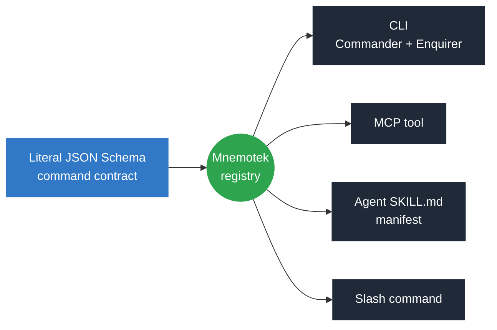

<p align="center">
  <a href="https://studnicky.github.io/mnemotek/">
    
  </a>
</p>

<h1 align="center">Mnemotek</h1>

<p align="center"><em>Describe an agentic command once. Derive its CLI, MCP tool, skill manifest, and slash command from that single contract.</em></p>

<p align="center">

[](https://github.com/Studnicky/mnemotek/actions/workflows/ci.yml)
[](https://github.com/Studnicky/mnemotek/actions/workflows/docs.yml)
[](https://github.com/Studnicky/mnemotek/actions/workflows/release.yml)
[](https://www.npmjs.com/package/@studnicky/mnemotek)
[](https://github.com/Studnicky/mnemotek/pkgs/npm/mnemotek)
[](package.json)
[](tsconfig.json)
[](LICENSE)

</p>

<p align="center"><strong><a href="https://studnicky.github.io/mnemotek/">Live demo & documentation</a></strong> — one <code>inspect</code> contract rendered as CLI, MCP, SKILL, and COMMAND output</p>

## What it does

Mnemotek takes one literal [JSON Schema](https://json-schema.org/) command contract and derives every surface an agentic tool needs from it, so the CLI flags, the MCP tool schema, the agent skill manifest, and the slash command definition can never drift out of sync with each other.



- **One source of truth.** The schema is authored as a literal object (`as const satisfies JSONSchema`) — no builder API, no separate type definitions to keep in sync.
- **Typed for free.** [`json-schema-to-ts`](https://github.com/ThomasAribart/json-schema-to-ts) derives TypeScript types directly from the schema at compile time.
- **Validated at the boundary.** [AJV](https://ajv.js.org/) validates every command payload at runtime through `@studnicky/json`'s `SchemaValidator`.
- **Configuration cascade.** Values resolve through schema defaults → package config → JSON config → environment → CLI, in that order.

## Usage

```ts
import { Mnemotek } from '@studnicky/mnemotek';
import { mnemotekContract } from '@studnicky/mnemotek/entities';

const app = new Mnemotek({
  name: 'project-tool',
  description: 'Project automation for humans and agents.'
});

app.command({
  name: 'inspect',
  description: 'Inspect the current project.',
  schema: {
    type: 'object',
    additionalProperties: true
  }
});

const isCommandName = mnemotekContract.CommandNameEntity.validate('inspect');

console.log(app.manifest());
```

## Install

```sh
npm install @studnicky/mnemotek
```

The package also publishes to GitHub Packages:

```sh
echo '@studnicky:registry=https://npm.pkg.github.com' >> .npmrc
npm install @studnicky/mnemotek
```

Entity schemas, types, and validators are exported separately:

```ts
import { mnemotekContract } from '@studnicky/mnemotek/entities';
```

## Packages

This repo is a pnpm workspace. The root `@studnicky/mnemotek` is the library; everything under `packages/*` is a small standalone CLI/MCP/skill tool built on it — each one just defines its commands as a Mnemotek manifest and gets a CLI, MCP adapter, and skill manifest for free. No package here depends on a graph database, an agent-orchestration proxy, or a live external API — each shells out only to tools already on a normal dev machine (`git`, `gh`, the target project's own `tsc`/`eslint`).

| Package | What it does |
|---|---|
| [`@studnicky/git-flow`](packages/git-flow) | Feature/release/hotfix branch orchestration: create, push, PR, CI wait, merge, tag, back-merge |
| [`@studnicky/redactor`](packages/redactor) | Strip ANSI/spinner noise from command output, track byte/token savings |
| [`@studnicky/config-standards`](packages/config-standards) | Check/fix `.gitignore` and `package.json` against a small built-in standards set |
| [`@studnicky/deps-audit`](packages/deps-audit) | Static import-graph analysis: circular imports, orphan modules, unused dependencies |
| [`@studnicky/inspect`](packages/inspect) | Run a project's own `tsc`/`eslint` and report structured pass/fail results |

## Development

```sh
pnpm install
pnpm run ci      # root package first — its test script builds dist/, which packages/* depend on
pnpm -r run ci   # then every package under packages/* (pnpm -r excludes the workspace root by design)
```

The Pages social preview is generated from the canonical transparent logo and the package version:

```sh
pnpm run generate:og
```

Release, publish, and documentation workflows run this generator automatically so the preview stays version-stamped. The local generator requires `rsvg-convert` from librsvg.

## License

MIT — see [LICENSE](./LICENSE).

## Changelog

See [CHANGELOG.md](./CHANGELOG.md) and the [GitHub releases](https://github.com/Studnicky/mnemotek/releases).
